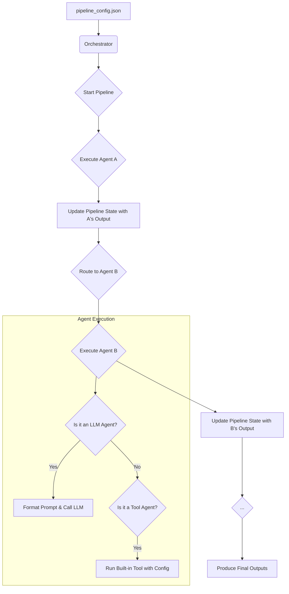

# Agentic Pipeline Framework

**Design, orchestrate, and execute complex LLM and tool-based workflows using a single, declarative JSON file. No Python code required.**

This framework empowers you to chain together Large Language Models (LLMs) and automated tools to create sophisticated pipelines for any task, from content generation to data processing and task automation. The entire workflow, including the initial data, agent logic, and routing, is defined in one place, making it easy to build, share, and version your creations.

---

## 🎯 Key Features

-   **Declarative by Design:** Define your entire multi-agent workflow in a single, human-readable JSON file.
-   **Zero-Code User Experience:** Users of the framework never need to write or edit Python code to create a new pipeline.
-   **LLM-Powered Logic:** Seamlessly integrate LLMs (via Ollama) to generate text, classify data, or make decisions within your pipeline.
-   **Built-in Tools:** Leverage a growing library of pre-built tools for common tasks like data extraction and parsing.
-   **Centralized State Management:** Each agent's output is added to a shared `pipeline_state`, allowing any subsequent agent to access data from any previous step.
-   **Extensible for Developers:** Easily add new built-in tools to the framework's core capabilities.

---

## ⚙️ How It Works (Conceptual Model)

The framework operates on a simple but powerful principle. The **Orchestrator** is the engine that reads your JSON configuration and executes the pipeline step-by-step.



1.  **Load:** The `main.py` script loads your specified `pipeline_config.json`.
2.  **Initialize:** The Orchestrator reads the config, identifies the `start_agent`, and prepares the `initial_input`.
3.  **Execute & Update:** It executes the current agent. The agent's outputs are saved to a central `pipeline_state` dictionary, keyed by `agent_id.output_name`.
4.  **Route:** The Orchestrator checks the `routing` rules to determine the next agent.
5.  **Repeat:** Steps 3 and 4 are repeated until an agent has no `next` step.
6.  **Finalize:** The Orchestrator uses the `final_outputs` mapping to present a clean, user-friendly result.

---

## 🚀 Getting Started

### Prerequisites

1.  **Python 3.8+**
2.  **Ollama:** Install and run Ollama from [ollama.com](https://ollama.com).
3.  **LLM Model:** Pull a model for the framework to use. We recommend a small, fast model for initial testing.
    ```bash
    ollama pull qwen2:0.5b
    ```

### Installation

1.  Clone the repository:
    ```bash
    git clone https://github.com/theblackcat98/agentic-pipeline-framework.git
    cd agentic-pipeline-framework
    ```
2.  Install the required Python packages:
    ```bash
    pip install -r requirements.txt
    ```

### Running a Pipeline

The framework is run from the command line, with the path to your configuration file as the only argument.

```bash
python main.py pipeline_config.json
```

This will execute the example content generation pipeline defined in the default `pipeline_config.json` file.

---

## 📝 Creating Your Own Pipeline: The `pipeline_config.json` Guide

This is the heart of the framework. To create your own workflow, you simply structure a JSON file according to the following schema.

### Top-Level Structure

These are the main keys of your JSON file.

| Key               | Type   | Description                                                                          | Required |
| ----------------- | ------ | ------------------------------------------------------------------------------------ | -------- |
| `pipeline_name`   | string | A descriptive name for your pipeline.                                                | Yes      |
| `initial_input`   | string | The initial data that the pipeline will start processing.                              | Yes      |
| `start_agent`     | string | The `id` of the first agent to be executed.                                          | Yes      |
| `agents`          | array  | An array of agent objects that define the work to be done. See details below.        | Yes      |
| `routing`         | object | A dictionary that defines the flow of control between agents. See details below.     | Yes      |
| `final_outputs`   | object | A mapping of user-friendly names to specific outputs from the `pipeline_state`.      | No       |

### Defining Agents (`agents` array)

Each object in the `agents` array defines a single work unit.

#### Common Agent Fields

| Key           | Type        | Description                                                                                             |
| ------------- | ----------- | ------------------------------------------------------------------------------------------------------- |
| `id`          | string      | A unique identifier for the agent (e.g., `parse_user_request`).                                         |
| `type`        | string      | The type of agent. Must be either `llm_agent` or `tool_agent`.                                          |
| `description` | string      | A human-readable description of what the agent does.                                                    |
| `inputs`      | object      | A mapping of the agent's required input names to their sources in the `pipeline_state`.                 |
| `outputs`     | array       | A list of string names for the outputs this agent will produce (e.g., `["category", "confidence"]`).    |

#### `llm_agent` Specific Fields

Use this type when you want an LLM to perform a task.

| Key               | Type   | Description                                                                                             |
| ----------------- | ------ | ------------------------------------------------------------------------------------------------------- |
| `model`           | string | The name of the Ollama model to use (e.g., `qwen2:0.5b`).                                               |
| `prompt_template` | string | The prompt to be sent to the LLM. Use `{input_name}` placeholders for dynamic data from the `inputs` map. |
| `output_format`   | string | (Optional) If set to `"list"`, the framework will attempt to parse the LLM's string output into a list.  |

#### `tool_agent` Specific Fields

Use this type to leverage a pre-built, non-LLM capability.

| Key           | Type   | Description                                                                       |
| ------------- | ------ | --------------------------------------------------------------------------------- |
| `tool_name`   | string | The name of the built-in tool to use (e.g., `StructuredDataParserTool`).          |
| `tool_config` | object | A JSON object containing specific configuration parameters for the chosen tool.   |

### Defining Data Flow (`inputs` object)

The `inputs` object for an agent tells it where to get its data from the shared `pipeline_state`. The format is:

`"local_input_name": "source_agent_id.output_name"`

**Example:**
To pass the `subject` output from the `ingest_email` agent to an agent that needs it as `email_subject`:

```json
"inputs": {
  "email_subject": "ingest_email.subject"
}
```
The very first agent typically uses `"pipeline.initial_input"` as its source.

### Defining Routing (`routing` object)

The `routing` object defines the execution path. For the MVP, this is a simple linear flow.

-   The keys are the `id` of the source agent.
-   The value is an object containing a `"next"` key, which specifies the `id` of the next agent to run.
-   If `"next"` is `null`, the pipeline terminates after that agent.

**Example:**
```json
"routing": {
  "agent_A": { "next": "agent_B" },
  "agent_B": { "next": "agent_C" },
  "agent_C": { "next": null }
}
```

### Defining Final Outputs (`final_outputs` object)

This provides a clean interface to the pipeline's results. It maps a simple name to a specific value in the final `pipeline_state`.

`"user_friendly_name": "source_agent_id.output_name"`

**Example:**
```json
"final_outputs": {
  "summary": "summarize_issue.text_summary",
  "ticket_url": "create_ticket.url"
}
```

---

## 🛠️ Built-in Tools

The framework comes with the following tools you can use in a `tool_agent`.

| Tool Name                  | Description                                                                                             |
| -------------------------- | ------------------------------------------------------------------------------------------------------- |
| `StructuredDataParserTool` | An LLM-powered tool that extracts structured fields from natural language. Requires `model` and `instructions` in its `tool_config`. |
| `RegexParserTool`          | A tool to extract data from text using regular expressions. Requires `patterns` in its `tool_config`. |

---

## 🗺️ Roadmap & Future Work

This framework is an MVP with a solid foundation. Future enhancements include:

-   [ ] **Advanced Routing:** Implement conditional (`if/else`) and parallel (`fan-out/fan-in`) routing logic.
-   [ ] **Multi-Provider LLM Support:** Add clients for other providers like OpenAI, Anthropic, and Google Gemini.
-   [ ] **Expanded Tool Library:** Add more built-in tools for tasks like making API calls, file I/O, and web searches.
-   [ ] **Streaming Support:** Enable real-time streaming of tokens from LLM agents.

## ❤️ Contributing

Contributions are welcome! If you have ideas for new features, tools, or improvements, please open an issue to discuss it first.

## 📄 License

This project is licensed under the MIT License. See the `LICENSE` file for details.