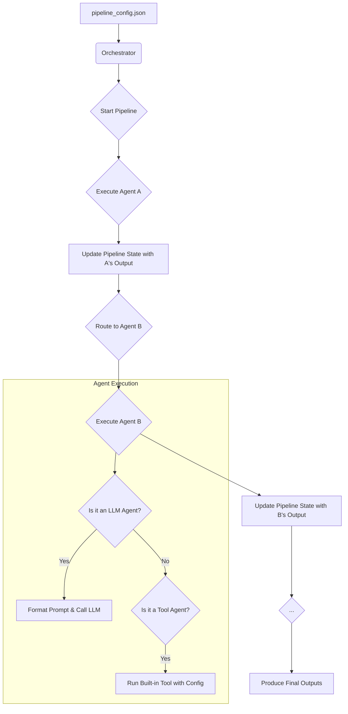

# Agentic Pipeline Framework

**Design, orchestrate, and execute complex LLM and tool-based workflows using a single, declarative JSON file. No Python code required.**

This framework empowers you to chain together Large Language Models (LLMs) and automated tools to create sophisticated pipelines for any task, from content generation to data processing and task automation. The entire workflow, including the initial data, agent logic, and routing, is defined in one place, making it easy to build, share, and version your creations.

---

## 📖 Full Documentation

For detailed information on installation, creating pipelines, API references, and development, please visit our **[Full Documentation Site (docs/index.md)](docs/index.md)**.

---

## 🎯 Key Features

-   **Declarative by Design:** Define your entire multi-agent workflow in a single, human-readable JSON file.
-   **Zero-Code User Experience:** Users of the framework never need to write or edit Python code to create a new pipeline.
-   **LLM-Powered Logic:** Seamlessly integrate LLMs (currently via Ollama) to generate text, classify data, or make decisions within your pipeline.
-   **Built-in Tools:** Leverage a growing library of pre-built tools for common tasks like data extraction and parsing. (See [Built-in Tools API Reference](docs/api_reference.md))
-   **Centralized State Management:** Each agent's output is added to a shared `pipeline_state`, allowing any subsequent agent to access data from any previous step.
-   **Extensible for Developers:** Easily add new built-in tools to the framework's core capabilities. (See [Developer Guide](docs/developer_guide.md))

---

## ⚙️ How It Works (Conceptual Model)

The framework operates on a simple but powerful principle. The **Orchestrator** is the engine that reads your JSON configuration and executes the pipeline step-by-step.



1.  **Load:** The `main.py` script loads your specified `pipeline_config.json`.
2.  **Initialize:** The Orchestrator reads the config, identifies the `start_agent`, and prepares the `initial_input`.
3.  **Execute & Update:** It executes the current agent. The agent's outputs are saved to a central `pipeline_state` dictionary, keyed by `agent_id.output_name`.
4.  **Route:** The Orchestrator checks the `routing` rules to determine the next agent.
5.  **Repeat:** Steps 3 and 4 are repeated until an agent has no `next` step.
6.  **Finalize:** The Orchestrator uses the `final_outputs` mapping to present a clean, user-friendly result.

For more details, see the [Pipeline Configuration Guide](docs/pipeline_config_guide.md).

---

## 🚀 Getting Started

For detailed setup and usage instructions, please refer to the **[Getting Started Guide](docs/getting_started.md)** in our documentation.

### Quick Installation Overview

1.  **Prerequisites:** Python 3.8+, Ollama installed and running, an Ollama LLM model pulled (e.g., `ollama pull qwen2:0.5b`).
2.  **Installation:**
    -   **From PyPI (Recommended):**
        ```bash
        pip install agentic-pipeline-framework
        ```
        *(This will be available once the package is published to PyPI.)*
    -   **From Source:**
        ```bash
        git clone https://github.com/theblackcat98/agentic-pipeline-framework.git
        cd agentic-pipeline-framework
        pip install .
        # For development: pip install -e .
        ```
3.  **Run an Example (after installation):**
    ```bash
    # If installed from PyPI or via 'pip install .' from source
    apf-run ./pipelines/pipeline_config.json

    # Or, if running directly from source without full installation:
    # python main.py ./pipelines/pipeline_config.json
    ```

---

## 🗺️ Roadmap & Future Work

We have many exciting features planned! Check out our **[Roadmap](docs/roadmap.md)** to see what's coming next.

---

## ❤️ Contributing

Contributions are highly welcome! Whether it's new features, tools, bug fixes, or documentation improvements, please see our **[Developer Guide](docs/developer_guide.md)** for details on how to contribute.

We encourage you to open an issue to discuss significant changes first.

---

## 📄 License

This project is licensed under the MIT License. See the [LICENSE](LICENSE) file for details, or our [License Documentation](docs/LICENSE.md).

---
*The original `https://code2tutorial.com/...` link has been removed as its content is now integrated or superseded by the new documentation structure.*
