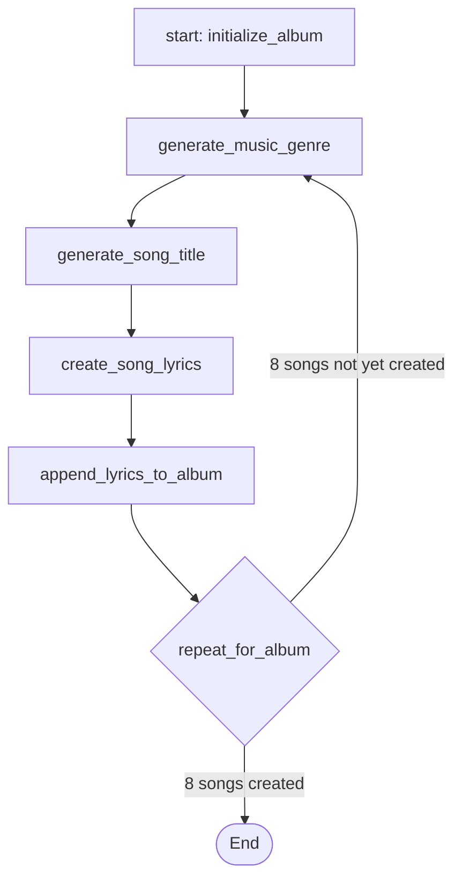

# Plan to Fix Pipeline Logic Flow

## 1. The Problem

The pipeline fails with a `ValueError: Unsupported agent type: 'ConditionalRouterTool'`. This error occurs because the `orchestrator.py` script is designed to only recognize two agent types: `llm_agent` and `tool_agent`. An agent in the `pipelines/music__album__creation__pipeline.json` file is incorrectly defined with its `type` set to `ConditionalRouterTool`.

## 2. Core Constraint

A key constraint is that the `pipelines/music__album__creation__pipeline.json` file must not be modified. Therefore, the solution must be implemented within the orchestrator itself.

## 3. Proposed Solution: Enhance the Orchestrator

The plan is to modify `orchestrator.py` to make it more flexible and capable of handling this scenario. Instead of a rigid check for agent types, the orchestrator will be updated to recognize when an agent's `type` corresponds directly to a tool in its `tool_registry`.

### Logic Modification in `orchestrator.py`

The execution loop will be updated with the following logic:

1.  Check if the agent `type` is `'llm_agent'`.
2.  Check if the agent `type` is `'tool_agent'`.
3.  **New Check:** Check if the agent `type` (e.g., `"ConditionalRouterTool"`) exists as a key in the `self.tool_registry`.
4.  If it does, treat it as a tool agent, using the `type` value as the `tool_name`.
5.  If none of the above, then raise the `ValueError`.

This change fixes the immediate error and makes the framework more robust for future use cases.

## 4. Conceptual Flow (Original Plan)

While we are not implementing the full looping logic at this time to respect the file constraint, the following diagram illustrates the conceptual flow of a correctly structured looping pipeline for this task.

## 5. Next Steps

With this plan approved, the next step is to switch to a coding-focused mode to apply the necessary changes to `orchestrator.py`.