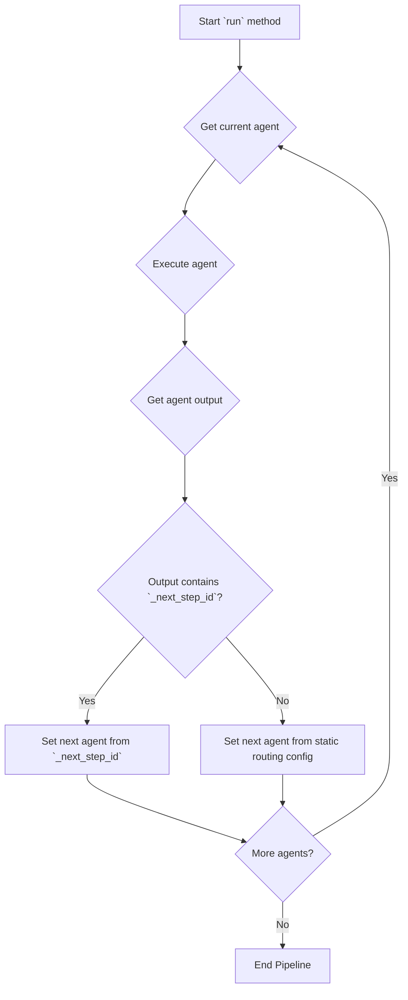

# Plan to Integrate `ConditionalRouterTool`

The current implementation of the `Orchestrator` does not support the `ConditionalRouterTool`, causing a `ValueError`. To fix this, I will update the orchestrator to handle this new tool and its conditional routing logic.

## 1. Update `orchestrator.py`

-   **Register New Tools:** I will import `ConditionalRouterTool`, `CodeExecutionTool`, and `DataAggregatorTool` from `tools/built_in_tools.py` and add them to the `tool_registry`.
-   **Implement Conditional Routing Logic:** I will modify the `run` method to check for a `_next_step_id` in the agent's output. If present, it will override the static routing.

### New Execution Flow

## 2. Update `pipelines/music__album__creation__pipeline.json`

-   **Correct Agent Type:** I will change the `type` for the `repeat_for_album` agent from `"ConditionalRouterTool"` to `"tool_agent"`. The `tool_name` is already correctly set to `ConditionalRouterTool`.

This plan will resolve the error and enable the conditional logic required by the album creation pipeline.